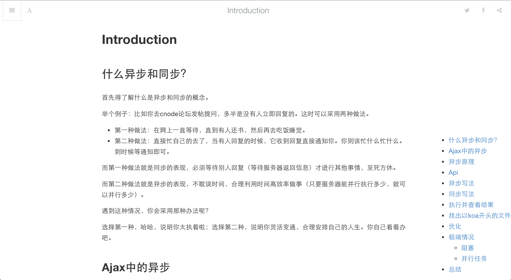

# gitbook-plugin-toc2

在gitbook里，回车，显示或隐藏toc



## 用法


在book.js或book.json

```
{
    "plugins": ["toc2"],
    "pluginsConfig": {
        "toc2": {
            "addClass": true,
            "className": "toc"
        }
    }
}
```

然后

```
$ gitbook install
```


在markdown文件加入 `<!-- toc --> `，当编译的时候回自动在这个位置增加toc

打开页面，默认会显示toc，回车，显示toc，再回车，隐藏toc。当然你也可以直接h隐藏

## 关于gitbook插件

### 文档

[官方的文档](http://developer.gitbook.com/plugins/index.html)极其的烂。。。。，这里还是推荐直接看源码里的文档

https://github.com/GitbookIO/gitbook/tree/master/docs

### 插件原理

读取book.js或book.json

```
    plugins: ["toc2"],
```

### 插件配置

```
    pluginsConfig: {
        sitemap: {
            hostname: 'https://toolchain.gitbook.com'
        },
        "toc2": {
            "addClass": true,
            "className": "toc"
        }
    }
```


用的时候

```
var pluginConfig = this.config.get('pluginsConfig.toc2', {});
```

和jq里的$.extend一样


### 入口index.js

```
module.exports = {
    // Extend website resources and html
    website: {
        assets: "./book",
        js: [
            "test.js"
        ],
        css: [
            "test.css"
        ],
        html: {
            "html:start": function() {
                return "<!-- Start book "+this.options.title+" -->"
            },
            "html:end": function() {
                return "<!-- End of book "+this.options.title+" -->"
            },

            "head:start": "<!-- head:start -->",
            "head:end": "<!-- head:end -->",

            "body:start": "<!-- body:start -->",
            "body:end": "<!-- body:end -->"
        }
    },

    // Extend ebook resources and html
    website: {
        assets: "./book",
        js: [
            "test.js"
        ],
        css: [
            "test.css"
        ],
        html: {
            "html:start": function() {
                return "<!-- Start book "+this.options.title+" -->"
            },
            "html:end": function() {
                return "<!-- End of book "+this.options.title+" -->"
            },

            "head:start": "<!-- head:start -->",
            "head:end": "<!-- head:end -->",

            "body:start": "<!-- body:start -->",
            "body:end": "<!-- body:end -->"
        }
    },

    // Extend templating blocks
    blocks: {
        // Author will be able to write "World"
        myTag: {
            process: function(blk) {
                return "Hello "+blk.body;
            }
        }
    },

    // Extend templating filters
    filters: {
        // Author will be able to write "{{ 'test'|myFilter }}"
        myFilter: function(s) {
            return "Hello "+s;
        }
    },

    // Hook process during build
    hooks: {
        // For all the hooks, this represent the current generator

        // This is called before the book is generated
        "init": function() {
            console.log("init!");
        },

        // This is called after the book generation
        "finish": function() {
            console.log("finish!");
        }
    }
```

按需就好，一般的css、js和回调hook等比较常用

### 入口指定的js

为了防止大量插件影响速度，所以才有requirejs这种amd的模块化加载机制

```
require(["gitbook", "jQuery"], function(gitbook, $) {

  // Return true if sidebar is open
  function isOpen() {
      return gitbook.state.$book.hasClass('with-summary');
  }
  
  var i = 1;
  $( window ).keydown(function( event ) {
    console.log(event.which)
    // enter = 13
    // t = 84
    if ( event.which === 13 || event.which === 84) {
      if (i % 2 == 1) {
        $('.markdown-section > ul').first().show().addClass('toc2')
      } else {
        $('.markdown-section > ul').first().hide()
      }
      
      i++;
    }
    
    // h = hide
    if(event.which === 72){
      $('.markdown-section > ul').first().hide()
    }
  });
  
  
  gitbook.events.bind("page.change", function() {
  
  });
  
});

```

内置jquery，所以整体来说和普通的jquery插件没啥区别，难度比较小

### 结合node模块写扩展

比如本例子中

```
var toc = require('marked-toc');
```

所以它的package.json里就需要安装对应的依赖

```
  "dependencies": {
    "marked-toc": "^0.3.0"
  },
```

### 事件

- page:before
- page:change
- init

事件绑定

```
  gitbook.events.bind("page.change", function() {
  
  });
```

等等

有时间比较有回调hook

其实如果为了高扩展，可以把hook写到配置项里，和jq插件一样

### engine配置

package.json必须写

```
 "engines": {
    "gitbook": "*"
  },
```

不然安装的时候找不到。即gitbook install的时候做的手脚

### 慢的问题

目前还无解

只能把SUMMARY里的内容减少到你当前需要的，切勿把所有的都放里，避免死翘翘

## 总结

gitbook的插件设计还是非常不错的。从markdown需要编译处下手，完成插件切入，集成。另外插件的配置方式、hook等都可圈可点。

通过gitbook install来安装gitbook-plugin-xx，也是个不错的实践。

对于设计express或koa插件机制来说，是个比较好的参考。
